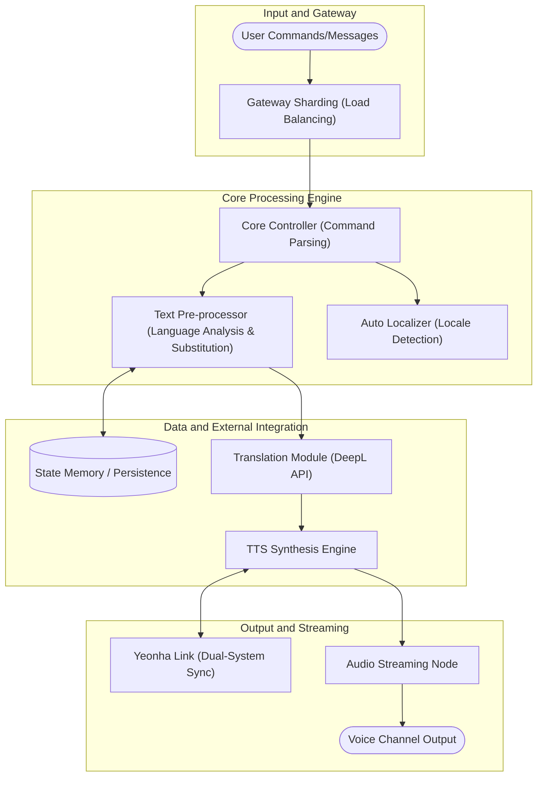

# Yeonhong - Technical Specifications and Logic Guide

  

[🇰🇷 한국어](README.md) | [🇯🇵 日本語](README.ja.md)

Yeonhong is a high-end service system designed for stable intelligent Text-to-Speech (TTS) synthesis and real-time data automation in large-scale distributed environments. This document focuses on the core logic and processing flow of the system.

---

## 🏗️ System Architecture and Logic Flow

The Yeonhong engine maintains an optimal state at all times, regardless of request volume, and distributes load through multi-clustering.

---

## 🌟 Core Technical Logic

### 1. Intelligent Text Pre-processing Logic
*   **Server-Specific Custom Substitution**: Beyond simple character replacement, the engine searches substitution rules defined in each server's database to convert text into the most contextually appropriate words before synthesis.
*   **Dynamic Filtering System**: It detects unnecessary URLs, emojis, and special characters in real-time to decide whether to read them, and includes Plaster Detection algorithms to prevent spam.

### 2. Hybrid Text-to-Speech (TTS) System
*   **Engine Redundancy Logic**: Dynamically selects the optimal option between local engines and high-quality API engines based on system load and request speed.
*   **Inter-Cluster State Synchronization**: When 'Yeonhong' and 'Yeonha' bots operate on the same server, they asynchronously share voice channel usage and resource occupancy to prevent conflicts.

### 3. Zero-Configuration Auto Localization
*   **Real-time Environment Sensing**: Detects server language setting changes and immediately applies the bot's nickname, help interface, and voice gender to the entire system without additional operation.
- **Multilingual Streaming Pipeline**: Upon receiving a message, the translation and TTS engines operate in parallel to stream the translated result as voice without synchronization delay.

---

## 🛠️ Operation and Scaling Logic
*   **Modular Architecture**: All features are separated into individual modules (Cogs), allowing real-time updates or fixes to specific functions without restarting the entire system.
*   **Sharding-based Scalability**: Efficient resource allocation and communication logic between shards are implemented to handle service scale expansion.

---

## 📝 Development Guidelines
This project prioritizes **scalability** and **automation**. All development follows multilingual support as a standard, aiming to provide a seamless experience that hides complex internal operations from the user.
