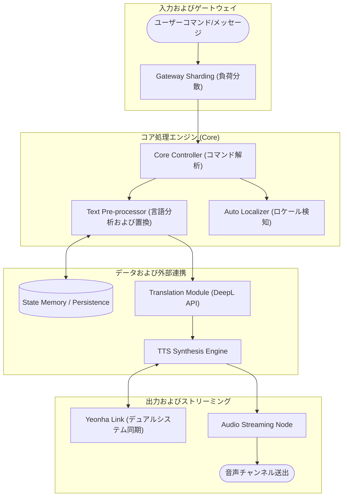

# ヨンホン (Yeonhong) - 기술 명세 및 로직 가이드

  

[🇰🇷 한국어](README.md) | [🇺🇸 English](README.en.md)

ヨンホン（Yeonhong）プロジェクトは、大規模な分散環境においてインテリジェントな音声合成（TTS）とリアルタイムデータの自動化を安定的に実行するためのハイエンドサービスシステムです。本ドキュメントでは、システムのコアロジックと処理フローを中心に説明します。

---

## 🏗️ システムアーキテクチャとロジックフロー

ヨンホンエンジンは、リクエストの有無にかかわらず常に最適な状態を維持し、マルチクラスタリングを通じて負荷を分散します。

---

## 🌟 コア技術ロジック

### 1. インテリジェントテキスト前処理ロジック (Text Pre-processing)
*   **サーバー別カスタム置換**: 単に文字を置き換えるだけでなく、各サーバーのデータベースに定義された置換ルールを検索し、文脈に最も適した単語に変換してから音声を合成します。
*   **動的フィルタリングシステム**: メッセージ内の不要なURL、絵文字、特殊文字などをリアルタイムで検知して読み上げの可否を決定し、連投防止アルゴリズム（Plaster Detection）が含まれています。

### 2. ハイブリッド音声合成（TTS）システム
*   **エンジン二重化ロジック**: システム負荷とリクエスト速度に応じて、ローカルエンジンと高品質なAPIエンジンのうち、最適なオプションをリアルタイムで選択します。
*   **クラスタ間の状態同期**: 「ヨンホン」と「ヨンハ」のボットが1つのサーバーで動作する場合、互いの音声チャンネルの使用状況とリソース占유状態を非同期で共有し、衝突を防止します。

### 3. 設定不要の自動ローカライズ (Auto Localization)
*   **リアルタイム環境検知**: サーバーの言語設定が変更されるイベントを検知し、ボットのニックネーム、ヘルプインターフェース、音声の性別などを別途操作することなく即座にシステム全体に反映します。
*   **多言語ストリーミングパイプライン**: メッセージ受信時に翻訳エンジンとTTSエンジンを並列で稼働させ、翻訳された結果を遅延なしに即座に音声として送出する同期ロジックを備えています。

---

## 🛠️ 運用および拡張ロジック
*   **モジュール型アーキテクチャ**: すべての機能は個別のモジュール（Cog）として分離されており、システム全体の再起動なしに特定の機能をリアルタイムでアップデートまたは修正できます。
*   **シャーディングベースの拡張性**: サービス規模の拡大に対応するため、シャード（Shard）間の効率的なリソース割り当てと通信ロジックが実装されています。

---

## 📝 開発指針
このプロジェクトは**拡張性**と**自動化**をコアバリューとしています。すべての開発事項は多言語サポートを基本とし、複雑な内部演算プロセスをユーザーに意識させないスムーズな体験の提供を目的としています。
