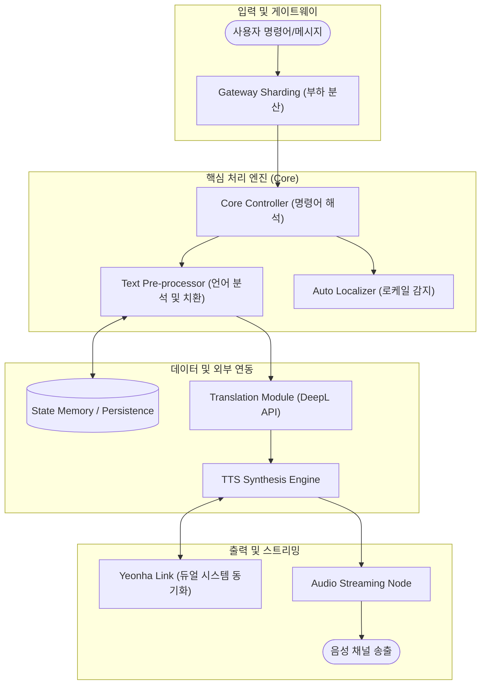

# 연홍 (Yeonhong) - 기술 명세 및 로직 가이드

  

[🇺🇸 English](README.en.md) | [🇯🇵 日本語](README.ja.md)

연홍 프로젝트는 대규모 분산 환경에서 지능형 음성 합성(TTS)과 실시간 데이터 자동화를 안정적으로 수행하기 위한 하이엔드 서비스 시스템입니다. 본 문서는 시스템의 핵심 로직과 처리 흐름을 중점적으로 다룹니다.

---

## 🏗️ 시스템 아키텍처 및 로직 흐름

연홍 엔진은 요청의 유무에 관계없이 항시 최적의 상태를 유지하며, 다중 클러스터링을 통해 부하를 분산합니다.

---

## 🌟 핵심 기술 로직

### 1. 지능형 텍스트 전처리 로직 (Text Pre-processing)
*   **서버별 맞춤형 치환**: 단순히 글자를 바꾸는 것에 그치지 않고, 각 서버의 데이터베이스에 정의된 치환 규칙을 검색하여 문맥에 가장 적합한 단어로 변환 후 음성을 합성합니다.
*   **동적 필터링 시스템**: 메시지 내의 불필요한 URL, 이모지, 특수문자 등을 실시간으로 감지하여 읽기 여부를 결정하며, 도배 방지 알고리즘(Plaster Detection)이 포함되어 있습니다.

### 2. 하이브리드 음성 합성(TTS) 시스템
*   **엔진 이중화 로직**: 시스템 부하와 요청 속도에 따라 로컬 엔진과 고품질 API 엔진 중 최적의 옵션을 실시간으로 선택합니다.
*   **클러스터 간 상태 동기화**: '연홍'과 '연하' 봇이 한 서버에서 작동할 때, 서로의 음성 채널 사용 현황과 자원 점유 상태를 비동기적으로 공유하여 충돌을 방지합니다.

### 3. 무설정 자동 로컬라이징 (Auto Localization)
*   **실시간 환경 감지**: 서버의 언어 설정이 변경되는 이벤트를 감지하여 봇의 닉네임, 도움말 인터페이스, 음성 성별 등을 별도의 조작 없이 즉시 시스템 전체에 반영합니다.
*   **다국어 스트리밍 파이프라인**: 메시지 수신 시 번역 엔진과 TTS 엔진을 병렬로 가동하여, 번역된 결과물을 지연 시간 없이 즉시 음성으로 송출하는 동기화 로직을 가지고 있습니다.

---

## 🛠️ 운영 및 확장 로직
*   **모듈형 아키텍처**: 모든 기능은 개별 모듈(Cog)로 분리되어 있어, 전체 시스템의 재시작 없이도 특정 기능을 실시간으로 업데이트하거나 수정할 수 있습니다.
*   **샤딩 기반 확장성**: 서비스 규모 확장에 대응하기 위해 샤드(Shard) 간의 효율적인 자원 할당 및 통신 로직이 구현되어 있습니다.

---

## 📝 개발 지침
이 프로젝트는 **확장성**과 **자동화**를 핵심 가치로 합니다. 모든 개발 사항은 다국어 지원을 기본으로 하며, 복잡한 내부 연산 과정을 사용자에게 드러내지 않는 매끄러운 경험 제공을 목적으로 합니다.